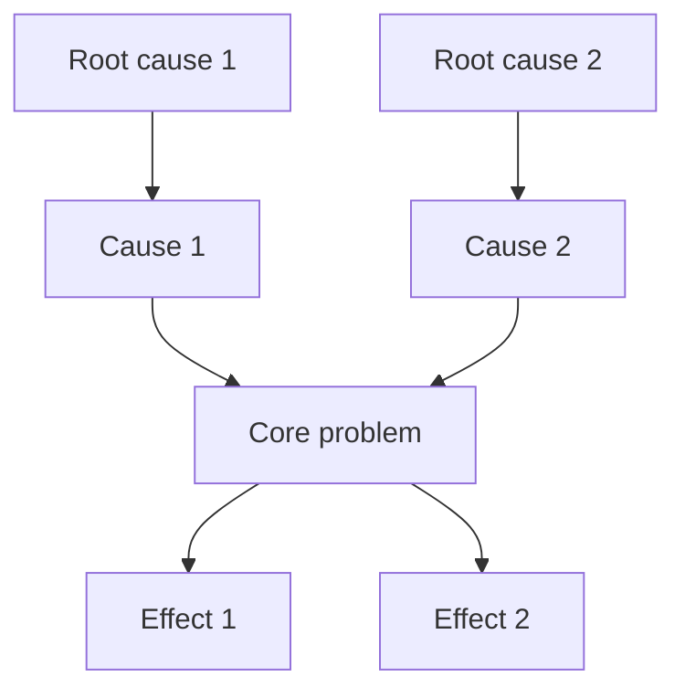

# Problem Tree (agent-executable)

## TL;DR

Effects up, causes down; find leverage point (root cause with widest reach).

## When to use

When the same problem keeps recurring. When a team disagrees on root cause. When you're about to invest in fixing a symptom. Pairs well with [[First-Principles]] for deep diagnosis.

## The model

```
          [Effect 3]   [Effect 4]
               ↑           ↑
          [Effect 1]   [Effect 2]
                  ↑    ↑
           [CORE PROBLEM]
                  ↓    ↓
          [Cause 1]   [Cause 2]
               ↓           ↓
         [Root 1]      [Root 2]   ← leverage point
```

**Effects** = what happens as a result (symptoms, complaints, costs)
**Core problem** = the central issue everyone agrees is bad
**Causes** = why the core problem exists
**Roots** = underlying conditions enabling the causes

## Agent instructions

1. State the core problem in a neutral factual sentence (no blame, no solution).
2. Work upward: list 3–5 effects (what does this problem cause?). Then effects of effects.
3. Work downward: for each cause ask "Why?" (5 Whys). Stop when you hit a structural root.
4. Identify the **leverage point**: the root cause where one intervention removes the most causes.

## 5 Whys drill (for each cause)

Keep asking "Why does this happen?" until you reach a structural or process-level root. If the same root appears under multiple causes — that's the leverage point.

## Output template

```markdown
## Core problem
[One neutral factual sentence]

## Effects (what this causes)
- Effect 1
  - Effect of effect (if applicable)
- Effect 2
- Effect 3

## Causes and roots
- Cause 1 → Root: [why does cause 1 exist?]
- Cause 2 → Root: [...]
- Cause 3 → Root: [...]

## Leverage point
**Root cause to target:** [which root]
**Rationale:** [why this root, not the others]

## Proposed intervention
[One sentence: what change removes this root cause?]

## What we will NOT fix
[Effects or causes that are downstream — they resolve if we fix the root]
```

## Mermaid diagram (optional)



## Role assignments

- **[[COO]]** — process/operational problems
- **[[CTO]]** — technical debt and incident analysis
- **[[CISO]]** — security incident post-mortems
- **[[CPO]]** — user churn and adoption failures

## After session

→ [[Decision-Matrix]] to evaluate intervention options. Store in `03-Brainstorm/sessions/`.
