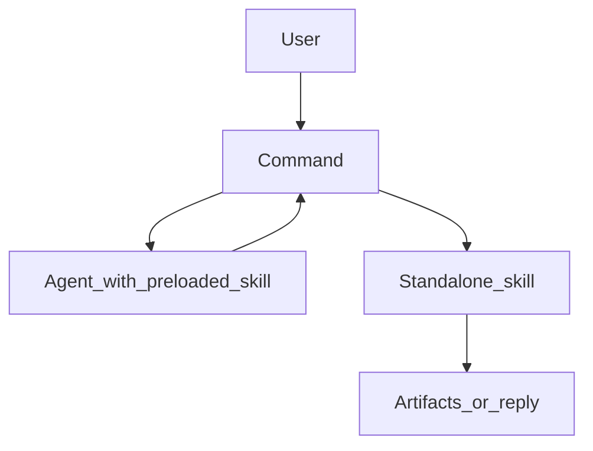

# Agent orchestration patterns

> **Command → Agent → Skill** is the reference pattern from the [claude-code-best-practice](https://github.com/shanraisshan/claude-code-best-practice) orchestration workflow. Use it when you need clear separation: user interaction, data work, and artifact generation.

---

## Two skill patterns

| Pattern | How it loads | Typical use |
|---------|----------------|-------------|
| **Agent skill (preloaded)** | Listed under `skills:` in **agent** frontmatter — full `SKILL.md` injected at agent start | Domain procedure the agent always follows (e.g. fetch data, audit checklist) |
| **Standalone skill** | Invoked via **Skill** tool from a command or main session | One-off output (report, SVG, codegen) using data already in context |

**Do not confuse:** Preloaded skills are **instructions in context**, not separate subagent invocations unless `context: fork` is set on the skill.

---

## Component roles

| Piece | Responsibility |
|-------|------------------|
| **Command** (`/.claude/commands/`) | Entry point: questions, branching, orchestration, calls Agent + Skill tools |
| **Agent** (`/.claude/agents/`) | Focused task with optional **preloaded** skills + tool allowlist |
| **Skill** (`/.claude/skills/.../SKILL.md`) | Packaged know-how; may run in main or **forked** context |

---

## Flow (conceptual)

---

## When to use what

| Situation | Prefer |
|-----------|--------|
| Same workflow many times/day | **Slash command** (git-friendly, discoverable) |
| Isolated research / search / review | **Subagent** (fresh context, tool limits) |
| Reusable domain knowledge | **Skill** (progressive disclosure, `paths` globs) |
| Quick edit | **Vanilla** session — avoid over-orchestrating small tasks |

**Rule of thumb:** More **commands** for inner loop; **feature-specific agents + skills** instead of one giant “QA” agent.

---

## Clean separation

- **Fetch / analyze** in agent (narrow tools, preloaded checklists)
- **Format / write artifacts** in skill (deterministic outputs)
- **Human gates** in command (confirm destructive or prod actions)

---

## BRUH repo wiring

- Root **`CLAUDE.md`** — stack, auth, DB, Capacitor, tests (source of truth)
- **`.claude/agents/`** — security review, test runner, deploy helper
- **`.claude/commands/`** — `/deploy`, `/security-review`, `/test`, `/context-load`
- **`.claude/skills/`** — Supabase + Capacitor pattern packs
- **Vault** — [[🏠 Home]], [[SESSION_HANDOFF]], [[Agent Quick Reference]], topic notes — load via `/context-load` or project rules

---

## Anti-patterns

- **Nested orchestration spaghetti** — keep one command as single conductor
- **Preloading huge skills** — bloats agent context; use `references/` + short core SKILL
- **Agents calling agents via bash** — use the **Agent** tool with explicit type

---

## See also

- [[Rules & Skills Authoring]] · [[Claude Code CLI Reference]] · [[Context Window Management]]

## Agent Frameworks — 2026-04-13

- **LangChain / LangGraph** — enterprise pipelines; LangGraph adds stateful graph-based flow for complex branching
- **AutoGen** — multi-agent conversations; agents negotiate task completion autonomously
- **OpenAI Agents SDK** — structured outputs + handoffs; built-in tracing; get multi-agent running in 15 min
- **LlamaIndex** — document-heavy RAG-first agents; best when corpus is the core
- Rule: LangGraph for orchestration complexity; OpenAI SDK for structured tool use; LlamaIndex for knowledge retrieval
