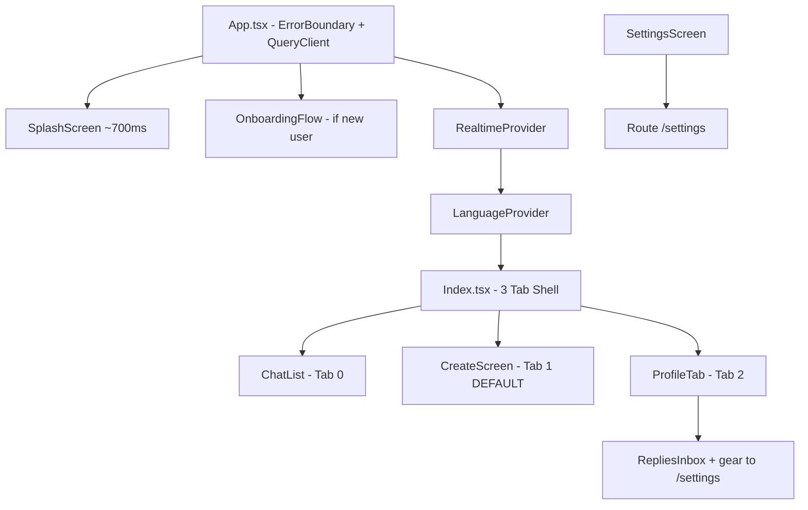

# App Architecture

## Provider Tree



---

## Tab Layout

| Tab | Index | Component | Default |
|-----|-------|-----------|---------|
| Chat | 0 | `ChatList` | No |
| Create | 1 | `CreateScreen` | **Yes** |
| Profile | 2 | `ProfileTab` (`RepliesInbox` + link to `/settings`) | No |

**Rules:**
- All **3** tabs are mounted simultaneously (horizontal swipe, no remount)
- `isActive` prop gates expensive queries — inbox polls only when Profile tab is active
- **`/inbox`** (legacy) opens **Profile** (index **2**)
- Default tab on cold load: **Create** (1) unless `sessionStorage bruh_active_tab` restores another
- **Settings** is a **separate route** (`/settings`, …), not a tab — opened from Profile gear
- BottomNav: **chat unread** on Chat tab (`CHAT_UNREAD_TOTAL_QUERY_KEY`); **new reply** count on **Profile** (`newReplyCount` from realtime). **Motion:** `LayoutGroup` + shared `layoutId` sliding gradient pill; spring icon scale; **`animate-badge-pop`** + `key={count}` on badges; active tab icons use **`stroke: url(#…)`** with defs gradient **`gradientUnits="userSpaceOnUse"`** (24×24 space) — required so **Plus** (thin strokes) does not vanish vs `objectBoundingBox`.

> [!note] Persisted tab index (`bruh_active_tab`): values **0–2**; old saved **3** clamps to **2**. Replay tour may set tab **1** (Create).

**Native back (Android):** Capacitor delivers `backButton` to **all** listeners in registration order — shell in `Index.tsx` must not win before overlays. **`src/lib/shellBackCoordinator.ts`** — LIFO `dispatchShellBack()`; GIF sheet, inbox, Create register/unregister on mount. iOS: no `backButton` event; swipe uses WebView history + `useSwipeBack` on `Screen` routes.

---

## App Shell CSS

| Rule | Value |
|------|-------|
| MobileFrame height | `100dvh` |
| Shell overflow | `hidden` |
| Scrolling | Only tab columns scroll |
| BottomNav | `absolute z-50` |
| GifBrowserSheet (inbox browse) | Portaled above nav: **`z-[60]`** — blocks tab bar until dismissed |
| Index padding | `pb-[calc(4.75rem+safe-area)]` when keyboard hidden |
| Max width card | `max-w-app-story` (Create tab) |

---

## Motion & transitions (main app)

Shipped **2026-04** — premium feel without new deps (`framer-motion` + Tailwind/CSS already in stack). **`prefers-reduced-motion`** honored (CSS + `useReducedMotion` on `Screen`).

| Area | Implementation |
|------|----------------|
| Lazy **routes** | `App.tsx` **`Screen`**: `motion.div` fade + slight `y` on mount |
| **BottomNav** | Spring scale on active tile; sliding gradient underline (`layoutId`); badge pop; SVG gradient stroke on active icon (defs in nav, `userSpaceOnUse`) |
| **CSS** (`index.css`) | `btn-shine` (one-shot shine, `::after` + `mix-blend-mode`); `bg-mesh-animated`; `create-card-ig-ring-3xl` (large-radius animated ring for profile upsell) |
| **Tailwind** | `animate-badge-pop`, `animate-glow-pulse` (available); existing `animate-gradient-shift` on accents/banners |
| **Lists / hubs** | Staggered `anim-fade-in-up` (e.g. `ChatList`, `SettingsScreen` rows); `RepliesInbox` post accent bar `animate-gradient-shift` |
| **Profile / Welcome / Subscription** | Mesh backdrop layers; profile banner gradient shift; staggered profile sections |
| **CTAs** | `btn-shine` on Welcome create, auth primaries, empty-state action, profile upgrade, subscription main button |

---

## Splash & Init Flow

```
Native launch
  └─ src/splash-failsafe.ts  (8s native timer → import main.tsx)
       └─ App.tsx
            ├─ SplashScreen (~700ms in-app)
            ├─ 12s max failsafe timer
            └─ BRUH_NATIVE_STORAGE_READY_EVENT (re-triggers auth gate after Preferences hydrate)
```

**Capacitor Preferences** hydrate async on native. Auth gate must wait for `BRUH_NATIVE_STORAGE_READY_EVENT` before reading user ID. Full startup order + storage keys: [[Startup Sequence & Storage Keys]]; Native Storage in [[Data Layer]].

---

## Premium Interstitial

- Shown on **every** remount of `/` or `/inbox` for non-premium users (no "every Nth open" gate — was removed)
- Appears **after** `tourAllDone === true` (onboarding must be complete)
- `isPremiumUserCached()` skips immediately; `isPremiumUser()` async confirms before opening modal
- **Timing:** 1.5s delay normally; **4.5s** when `bruh_app_opens >= 8` (rate-app popup fires at 1s on those sessions — gives rate-us space to show first)
- Effect uses `cancelled` flag on unmount for async safety (prevents setState after unmount)
- See [[Monetization]] for premium check functions

---

## Key File Locations

| File | Purpose |
|------|---------|
| `src/App.tsx` | Root — ErrorBoundary, QueryClient, providers, deep link handler |
| `src/pages/Index.tsx` | 3-tab shell + premium interstitial |
| `src/components/screens/ProfileTab.tsx` | Tab 2 — profile surface; embeds **`RepliesInbox`**; Fortune Wheel button card → **`/fortune-wheel`**; gear → **`/settings`** |
| `src/components/screens/FortuneWheelPage.tsx` | Route **`/fortune-wheel`** — prize banner, `FortuneWheel` component, how-it-works card (`SettingsSubpageShell`) |
| `src/components/screens/RepliesInbox.tsx` | Meme posts / inbox list (used inside Profile tab) |
| `src/components/screens/CreateScreen.tsx` | Tab 1 — question card; **Challenges** in card footer; publish button: pulse-ring + shimmer when enabled, spring-bounce success state |
| `src/components/screens/ChatList.tsx` | Tab 0 — DM list |
| `src/components/screens/ChatThread.tsx` | Route `/chat/:conversationId` |
| `src/components/chat/chatUi.ts` | Shared chat layout/surface classes (list header, header bar, bubbles, composer) |
| `src/components/screens/SettingsScreen.tsx` | Route **`/settings`** — settings hub only (not a tab) |
| `src/components/screens/settings/SettingsSubpageShell.tsx` | Shared header + scroll + Android back for settings subpages |
| `src/components/BottomNav.tsx` | Bottom navigation (absolute, unmounts on keyboard) |
| `src/components/MemeReplyPicker.tsx` | Reply picker — **native-only**, has Capacitor guard |
| `src/components/GifBrowserSheet.tsx` | GIF browser — My Own 3-col grid + search |
| `src/lib/queryKeys.ts` | All React Query keys — never inline in components |
| `src/lib/user/` | All user domain logic |
| `src/lib/nativeStorage.ts` | Capacitor Preferences bridge |

---

## GifBrowserSheet Details

- **My Own tab**: 3-column grid of local GIFs, creator CTAs, Manage → `/personal-media`
- **`GifPlayer`** component + `previewFrameData` for animated local GIFs
- `saveAnimatedGif` stores `frameData`; `dataUrl` is a static preview (not animated)
- Passes `previewFrameData` to render animated preview without re-decoding

---

## Sheet Pattern

All bottom sheets use:
```ts
getBottomSheetPortalTarget()  // portal container
```
Combined with `AnimatePresence` + portal pattern for proper stacking and animation.

---

## See also

- [[Chat System]]
- [[Data Layer]]
- [[🏠 Home]]
