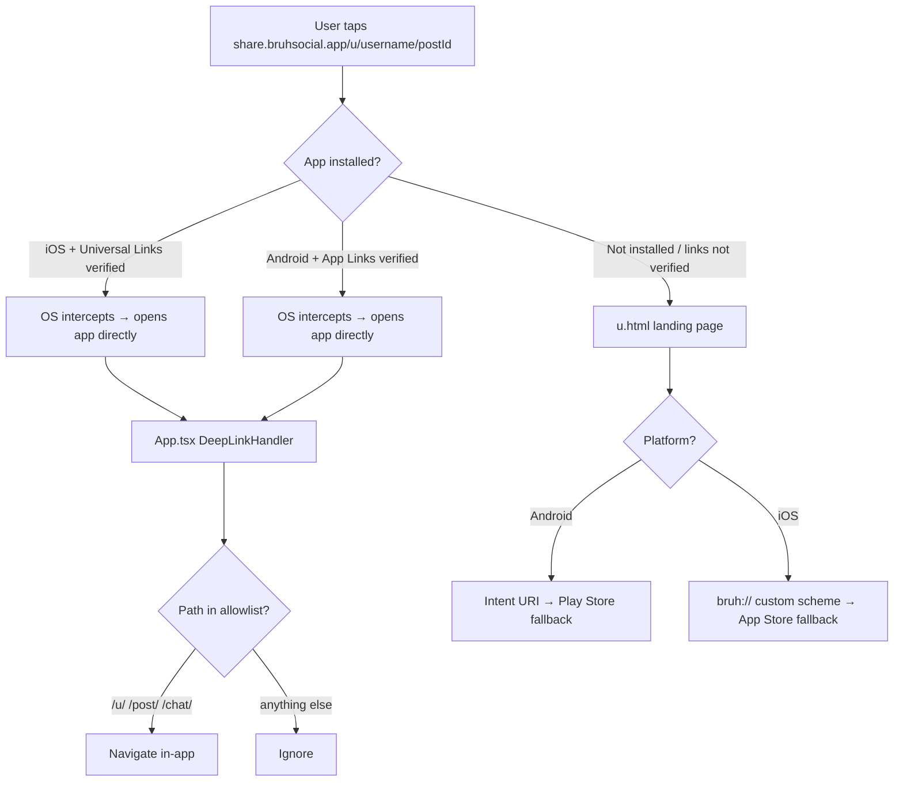

# Deep Links & PWA

## Deep Link Flow



---

## Universal Links (iOS)

### AASA File
`landing/.well-known/apple-app-site-association` — already configured:
- Team ID: `39FVY58F26`
- Bundle ID: `app.bruhsocial.app`
- Paths: `/u/*`, `/post/*` (in-app handler also allows **`/chat/*`** for push / internal opens; extend AASA/assetlinks if you want verified HTTPS opens to chat from the share domain)

### Entitlement
```xml
<!-- ios/App/App/App.entitlements -->
<key>com.apple.developer.associated-domains</key>
<array>
  <string>applinks:share.bruhsocial.app</string>
</array>
```

Served at: `https://share.bruhsocial.app/.well-known/apple-app-site-association`
Content-Type must be `application/json` (no `.json` extension).

---

## App Links (Android)

### assetlinks.json
`landing/.well-known/assetlinks.json` — already configured:
- Package: `com.bruh.app`
- Both fingerprints present:
  1. `8E:65:83:EA:E2:DD:12:84:88:38:80:38:CB:87:CC:7D:A6:45:4F:24:BB:61:7B:AE:14:5C:39:CA:0D:D0:34:F9` (Google Play App Signing key)
  2. `27:2F:8D:AA:C1:87:68:DF:FA:7F:C6:63:F5:BC:1B:FF:6B:57:C3:52:D0:7A:03:43:B0:F0:20:86:16:92:19:23` (upload key)

Served at: `https://share.bruhsocial.app/.well-known/assetlinks.json`

### Intent Filter in AndroidManifest
```xml
<intent-filter android:autoVerify="true">
  <action android:name="android.intent.action.VIEW"/>
  <category android:name="android.intent.category.DEFAULT"/>
  <category android:name="android.intent.category.BROWSABLE"/>
  <data android:scheme="https" android:host="share.bruhsocial.app"/>
</intent-filter>
```

---

## `u.html` Fallback Page

Located at `landing/u.html` — shown when app is not installed or OS link verification fails.

**Android flow in u.html:**
```
Intent URI attempt → timeout → Play Store URL
intent://share.bruhsocial.app/u/...#Intent;scheme=https;package=com.bruh.app;end
```

**iOS flow in u.html:**
```
window.location = 'bruh://u/username/postId'  ← custom scheme attempt
setTimeout → App Store URL                      ← if app not installed
```

Intent URI is used instead of universal links in Chrome for Android because Chrome handles intent URIs more reliably.

---

## `DeepLinkHandler` (App.tsx)

```ts
// Allowlist — only these paths trigger in-app navigation
const ALLOWED_PREFIXES = ['/u/', '/post/', '/chat/'];

// Handles both:
// - Capacitor App.addListener('appUrlOpen', ...) — cold start
// - Capacitor App.addListener('resume', ...) — foreground from deep link
```

> [!warning] The allowlist is a security boundary. Adding new paths here means they can be triggered by any external link. Only add paths that are safe to open without auth checks.

---

## Custom URL Scheme

`bruh://` registered in `ios/App/App/Info.plist`:
- Used as iOS fallback when Universal Links can't be verified
- Also handles inter-app communication on iOS

---

## PWA Service Worker

### Service Worker Killer Pattern
The app uses a service worker killer to prevent stale React app from being served after deploys:

**`landing/sw.js`** (or similar):
```js
self.addEventListener('install', () => self.skipWaiting());
self.addEventListener('activate', e => {
  e.waitUntil(
    caches.keys().then(keys => Promise.all(keys.map(k => caches.delete(k))))
  );
});
```

Plus `Clear-Site-Data` header on deploy to ensure all caches are cleared.

### Netlify Config
`landing/netlify.toml` — single Netlify site serves:
- `bruhsocial.app` (main domain)
- `share.bruhsocial.app` (alias)

Both domains point to the same site. `_redirects` handles routing.

### PWA Headers
`public/_headers` (Netlify) sets security headers including:
- `Cache-Control` for versioned assets
- `Clear-Site-Data` on the service worker path
- Security headers (see [[Security Reference]])

---

## Netlify DNS Note

> [!important] DNS for `bruhsocial.app` lives in **Netlify DNS** (Netlify is the zone authority).
> The `admin` subdomain is a **CNAME → Vercel** in Netlify's DNS zone.
> The ops admin is hosted on Vercel, not a Netlify site.
> Use the Netlify REST API for DNS changes — never the `netlify` CLI `createDnsRecord` command (buggy).
